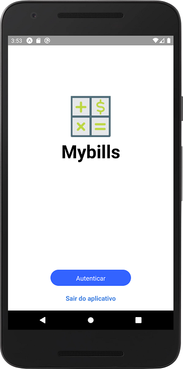

# React Native - Mybills

A finance Application using React Native, styled-components

## Index

-  [ScreenShots](#screenshots)

   -  [Login](#login)

-  [Built With](#built-with)

   -  [Libraries](#libraries)

## ScreenShots

### Login

This is the app's main screen.

## Built With

### Libraries

-  [styled-components](https://github.com/styled-components/styled-components)
-  [React Navigation](https://github.com/react-navigation/react-navigation)
-  [React Navigation Stack](https://github.com/react-navigation/stack)
-  [React Native Gesture Handler](https://github.com/kmagiera/react-native-gesture-handler)
-  [React Native Reanimated](https://github.com/kmagiera/react-native-reanimated)
-  [React Native Screens](https://github.com/kmagiera/react-native-screens)
-  [Vector Icons](https://github.com/oblador/react-native-vector-icons)
